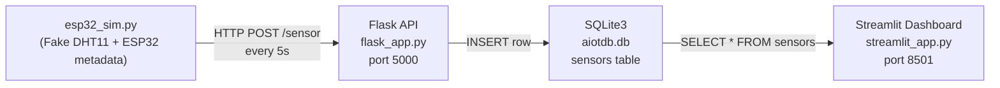

# AIoT Demo — Final Report

**Project Directory:** `c:\Users\USER\IoT_L1`
**Date:** 2026-03-24
**Stack:** ESP32 Simulator → Flask (HTTP) → SQLite3 → Streamlit

---

## Architecture



---

## Files Created

| File | Purpose |
|---|---|
| [flask_app.py](file:///c:/Users/USER/IoT_L1/flask_app.py) | Flask REST API — `/health`, `/sensor`, `/sensors`, `/sensors/count` |
| [esp32_sim.py](file:///c:/Users/USER/IoT_L1/esp32_sim.py) | ESP32 simulator — fake DHT11 readings every 5s |
| [streamlit_app.py](file:///c:/Users/USER/IoT_L1/streamlit_app.py) | Streamlit dashboard — KPIs, charts, raw data table |
| [requirements.txt](file:///c:/Users/USER/IoT_L1/requirements.txt) | Python dependency list |

---

## Verification Results

| Check | Result |
|---|---|
| `/health` endpoint | ✅ `{"status": "ok", "db": "C:\\Users\\USER\\IoT_L1\\aiotdb.db"}` |
| ESP32 simulator POSTs | ✅ Continuous `201` responses |
| SQLite DB inserts | ✅ Rows accumulating in `sensors` table |
| Streamlit dashboard | ✅ Rendering with live data |

### Dashboard Verified

KPIs observed: **29 readings**, **28.5 °C avg temp**, **59.2% avg humidity**, device **ESP32-AIOT-001**.

Both Temperature (red) and Humidity (teal) line charts rendering. Raw data table displaying last 200 rows with auto-refresh.


---

## Running Services

| Component | Status | URL |
|---|---|---|
| Flask API | ✅ Running | `http://127.0.0.1:5000` |
| ESP32 Simulator | ✅ Running | posts every 5s |
| Streamlit Dashboard | ✅ Running | `http://localhost:8501` |
| SQLite3 DB | ✅ Populating | `c:\Users\USER\IoT_L1\aiotdb.db` |

---

## Re-run Commands

```powershell
# Terminal 1 — Flask
cd c:\Users\USER\IoT_L1
.\venv\Scripts\python.exe flask_app.py

# Terminal 2 — ESP32 Simulator
cd c:\Users\USER\IoT_L1
.\venv\Scripts\python.exe esp32_sim.py

# Terminal 3 — Streamlit Dashboard
cd c:\Users\USER\IoT_L1
.\venv\Scripts\python.exe -m streamlit run streamlit_app.py --server.port 8501
```

> [!TIP]
> To reset the database, delete `aiotdb.db` — Flask will recreate it on next startup.
